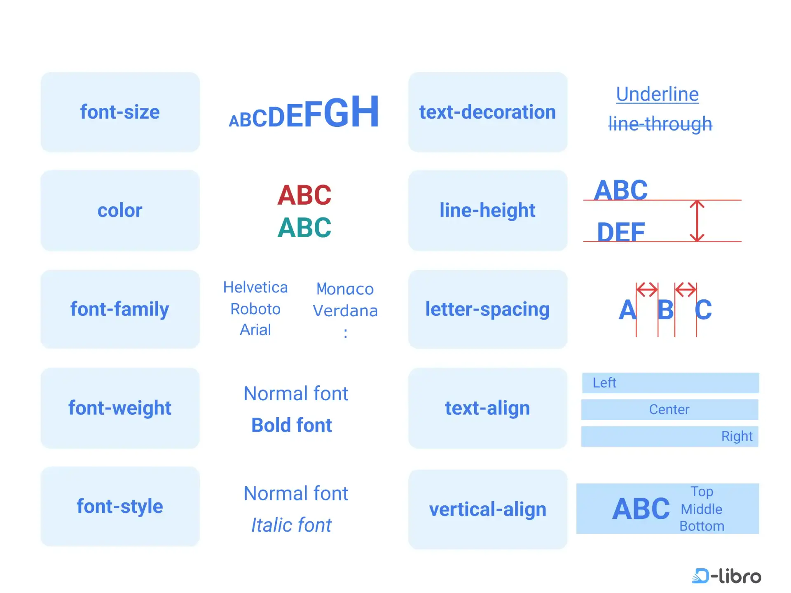
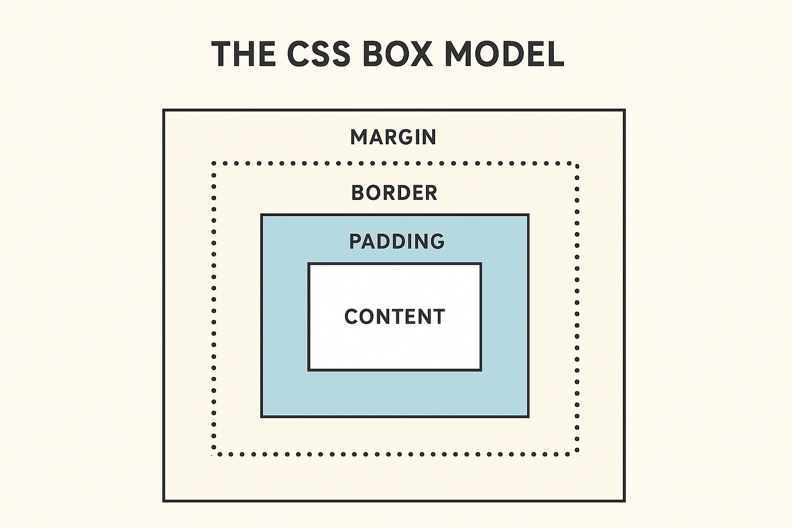

# Теория ко второму занятию

## Формальное определение CSS и концепция «Каскада»

**CSS (Cascading Style Sheets — Каскадные таблицы стилей)** — это декларативный формальный язык, предназначенный для описания внешнего вида (представления) документа, написанного с использованием языка разметки (HTML).

Если HTML формирует логическую структуру и семантику данных (DOM-дерево), то CSS отвечает за визуальную модель отображения этих данных на экране, при печати или при чтении скринридерами.

Особое внимание нужно уделить слову **«Каскадные»**. Каскад в CSS — это фундаментальный базовый алгоритм, который решает конфликты. В масштабных проектах к одному и тому же элементу (например, кнопке) могут применяться десятки разных правил из разных файлов. Каскад — это строгий свод математических правил (основанных на порядке исходного кода, специфичности селекторов и важности), который определяет, какое именно свойство в итоге "победит" и будет применено к элементу.

### Архитектурный паттерн: Разделение ответственности (Separation of Concerns)

В современной веб-разработке строго соблюдается принцип **Разделения ответственности (Separation of Concerns)**	 — это концепция проектирования, при которой программа разделяется на отдельные модули, каждый из которых отвечает за свою уникальную задачу.

Исторически (в ранних версиях HTML) визуальные атрибуты (например, `<font color="red">`) писались прямо внутри HTML-тегов. Это приводило к дублированию кода, трудностям в поддержке и раздуванию веса страниц. Разделение содержания (HTML) и представления (CSS) решает три глобальные инженерные задачи:

1. **Масштабируемость и переиспользование:** Один файл CSS может управлять дизайном тысяч HTML-страниц. Изменив цвет в одном месте (в CSS), вы мгновенно меняете его на всем сайте.

2. **Чистота семантики:** HTML-документ остается легковесным, легко читается поисковыми роботами (SEO) и программами для людей с ограниченными возможностями (скринридерами).

3. **Кэширование:** Браузер пользователя загружает файл стилей (`style.css`) только один раз при первом посещении сайта и сохраняет его в памяти (кэше). При переходе на другие страницы сайта браузеру не нужно заново скачивать стили, что радикально ускоряет загрузку.

### Три метода интеграции CSS (И почему мы выбираем один)

Существует три технических способа связать стили с HTML-элементами. Мы должны знать все три, чтобы понимать их недостатки:

1. **Inline (Встроенные/Локальные стили):** Написание CSS прямо внутри HTML-тега с помощью атрибута style (например, `<p style="color: red;">`).

	- Считается антипаттерном в классической верстке. Нарушает принцип разделения ответственности, код становится невозможно поддерживать.

2. **Internal (Внутренние/Глобальные стили):** Написание CSS-кода внутри парного тега `<style>`, который располагается в `<head>` документа.

	- Допустимо для очень маленьких страниц или специфических задач (например, стили для почтовых рассылок), но не позволяет переиспользовать стили между разными HTML-страницами проекта.

3. **External (Внешние/Связанные стили):** Вынос всего CSS-кода в отдельный файл с расширением .css и его подключение к HTML

	- Индустриальный стандарт. Именно этот метод обеспечивает правильную архитектуру и кэширование.

Для реализации внешнего подключения (External) создается текстовый файл, например `style.css`. Чтобы HTML-документ узнал о существовании этого файла, мы должны установить между ними связь.

```html
<head>
    <link rel="stylesheet" href="style.css">
</head>
```

## Механизмы поиска: CSS-Селекторы и синтаксис правил

### Концепция сопоставления с образцом (Pattern Matching)

Вся работа каскадных таблиц стилей строится на механизме поиска нужных узлов (элементов) в DOM-дереве (объектной модели документа). Инструмент, с помощью которого браузер находит элементы для стилизации, называется селектором.

Базовый синтаксис CSS-правила неизменен и состоит из двух частей:

-  **Селектор:** Указывает браузеру, какие именно элементы нужно выбрать.

- **Блок объявлений:** Заключается в фигурные скобки { } и содержит набор инструкций (свойств и значений), которые будут применены к выбранным элементам.

Существует три базовых типа селекторов, каждый из которых имеет свое архитектурное предназначение:

**1. Селектор типа (Type Selector): Базовое переопределение**

Осуществляет поиск элементов исключительно по имени их HTML-тега.

```css
p {
	color: red;
}
```
**Как работает:** Данное правило будет применено к абсолютно всем абзацам (тегам `<p>`) в документе, независимо от того, где они находятся.

**Применение в архитектуре:** Используется редко и только для глобальных (базовых) настроек. Например, чтобы задать единый шрифт для всего тега `<body>` или сбросить стандартные отступы браузера. Не рекомендуется для стилизации интерфейса, так как такие правила трудно контролировать по мере роста проекта.

**2. Селектор класса (Class Selector): Инкапсуляция и переиспользование**

Это фундаментальный инструмент современной веб-разработки. Он связывает CSS-правило со значением атрибута `class` в HTML. В таблице стилей селектор класса обязательно начинается с точки (`.`).

В HTML: `<button class="btn-primary">Купить</button>`

В CSS:
```css
.btn-primary {
  color: white;
  background-color: blue;
}
```

**Как работает:** Правило применится ко всем элементам на странице, в атрибуте `class` которых указано значение `btn-primary`.

**Применение в архитектуре:** Классы позволяют создавать независимые, переиспользуемые UI-компоненты (модули). Одному HTML-элементу можно назначить сразу несколько классов через пробел, а один класс можно применять к бесконечному числу различных элементов. Это обеспечивает гибкость и чистоту кода.

**3. Селектор идентификатора (ID Selector): Строгая уникальность**

Этот селектор обращается к уникальному атрибуту `id`. В CSS он обозначается символом решетки (`#`).

В HTML: `<header id="main-header">...</header>`

В CSS:
```css
#main-header {
  background-color: black;
}
```

**Как работает:** Согласно строгим стандартам HTML, значение атрибута id обязано быть абсолютно уникальным в рамках одного документа. Следовательно, этот селектор выберет только один, строго конкретный элемент на странице.

**Применение в архитектуре:** В современной CSS-разработке использование ID-селекторов для стилизации считается антипаттерном (плохой практикой). Они обладают чрезмерно высокой «специфичностью» (весом), из-за чего их визуальные правила в будущем очень сложно переопределить другими классами. Идентификаторы рекомендуется оставлять исключительно для создания якорных ссылок в HTML или для взаимодействия с логикой на JavaScript.

## Синтаксис объявлений и базовые свойства (Типографика и Цвет)

### Строгий синтаксис CSS-объявления (Declaration)

Внутри блока правил (между фигурными скобками селектора) располагаются **объявления** (declarations). CSS — это строго типизированный язык описания, поэтому каждое объявление формируется в виде классической пары «ключ-значение»: `свойство: значение;`.

- **Свойство (Property)** — это стандартизированный идентификатор, определяющий, *какой именно* аспект визуального отображения элемента мы хотим модифицировать (например, цвет, размер, отступ).

- **Значение (Value)** — конкретный параметр или величина, применяемая к данному свойству.

*Критическое правило синтаксиса:* Идентификатор свойства и его значение всегда разделяются двоеточием (`:`). Каждое объявление **обязательно** завершается точкой с запятой (`;`). Точка с запятой выступает в роли терминатора (ограничителя) инструкции. Она сообщает анализатору (парсеру) браузера, что текущая команда завершена и можно переходить к чтению следующей. Пропуск этого символа — самая частая причина поломки стилей у начинающих разработчиков.

### Цветовые модели и управление фоном (Color & Background)

В веб-разработке цвет можно задавать несколькими стандартами: от простых текстовых констант (ключевых слов) до точных шестнадцатеричных кодов (HEX-кодов, например, `#ff0000` для чистого красного), которые позволяют кодировать миллионы оттенков RGB-палитры.

- `color` — управляет цветом переднего плана (foreground color). В контексте текстовых блоков это свойство окрашивает сами символы (буквы) внутри HTML-узла.
- `background-color` — устанавливает цвет фона (background) элемента. Важно понимать, что заливка фона применяется ко всей прямоугольной области, которую занимает элемент, включая его внутренние отступы (padding), о которых пойдет речь при разборе блочной модели.

### Основы типографики (Управление шрифтами)

Управление текстом в CSS осуществляется через специализированную группу свойств, объединенных префиксом `font-`.

- `font-size` — определяет кегль (размер) шрифта. Базовой единицей измерения на начальных этапах выступают абсолютные пиксели (`px`, например: `font-size: 20px;`), что позволяет жестко зафиксировать габариты символов на экране.

- `font-weight` — задает насыщенность (жирность) начертания символов. Значение может передаваться как константами (`normal` для обычного текста, `bold` для жирного), так и точными числовыми градациями сотен от `100` (максимально тонкий) до `900` (максимально жирный). В этой шкале стандартный текст имеет вес `400`, а классический жирный — `700`.

- `font-family` — устанавливает гарнитуру (семейство) шрифта. 

```css
font-family: Arial, sans-serif;
font-weight: 600;
font-size: 12px;
```

*Как это работает:* Шрифты перечисляются через запятую в порядке приоритета. Если на операционной системе пользователя отсутствует первый шрифт (`Arial`), браузер не выдаст ошибку, а автоматически перейдет к следующему значению. Последним аргументом всегда указывается обобщенное, базовое семейство — например, `sans-serif` (системный шрифт без засечек) или `serif` (с засечками). Это гарантирует, что даже если уникальный дизайнерский шрифт не загрузится, текст останется читаемым и сохранит общую стилистику.



## Блочная модель CSS (CSS Box Model): Фундаментальная геометрия

### Концепция прямоугольного контейнера**

В основе визуального рендеринга веб-документов лежит спецификация **CSS Box Model**. Математический алгоритм браузера устроен так, что абсолютно каждый узел DOM-дерева вычисляется и отрисовывается как строгий прямоугольный контейнер (box). Даже если визуально элемент выглядит как идеальный круг (за счет свойства `border-radius`), его физическая модель взаимодействия с другими элементами остается прямоугольной.

Геометрия и итоговый размер каждого такого контейнера складываются из четырех концентрических логических слоев (областей):

* **Область содержимого (Content Box):** Центральное ядро элемента, в котором располагается фактическая полезная нагрузка (текстовые узлы, медиафайлы или дочерние HTML-элементы). Габариты этой области напрямую контролируются свойствами `width` (ширина) и `height` (высота).

* **Внутренний отступ (Padding Area):** Буферное пространство между областью содержимого и границей элемента. Важнейшее архитектурное свойство padding заключается в том, что он **является неотъемлемой частью самого контейнера**. Соответственно, любая фоновая заливка (`background-color`) или фоновое изображение распространяются на эту область. Увеличение `padding` физически расширяет габариты элемента изнутри.

* **Граница (Border Area):** Линия, инкапсулирующая контент и внутренние отступы. Она определяет физический предел самого элемента. Для её отрисовки необходимо задать три параметра: толщину (`width`), стиль линии (`style` — например, `solid` или `dashed`) и цвет (`color`).

* **Внешний отступ (Margin Area):** Абсолютно прозрачная буферная зона («зона отчуждения») за пределами границы элемента. `Margin` **не принадлежит** самому элементу; его единственная математическая функция — управлять дистанцией между соседними узлами в нормальном потоке документа (normal flow). Он физически расталкивает соседние прямоугольники, не позволяя им слипаться.



### Синтаксис и управление векторами направлений

Синтаксис позволяет задавать значения как комплексно (через свойства-сокращения, *shorthands*), так и точечно.

```css
.card {
    padding: 20px;
    border: 2px solid black;
    margin: 30px;
}

```

**Специфичные векторы (Directional Properties):**
В CSS реализован механизм точечного управления геометрией. Разработчик не обязан задавать отступы симметрично. Для каждого из четырех слоев (кроме контента) существуют специализированные подсвойства, определяющие конкретный вектор направления: `top` (верх), `right` (право), `bottom` (низ), `left` (лево).

*Пример:* Использование `margin-top: 10px;` приведет к вычислению внешней дистанции исключительно по верхней оси Y, в то время как по остальным трем осям отступ останется нулевым (или унаследованным по умолчанию). Это критически важно для точного позиционирования модулей интерфейса.

## Средства объективного контроля: Инструментарий разработчика (DevTools)

### Проблема визуализации и инженерный подход

Поскольку внешние отступы (`margin`) абсолютно прозрачны, а все элементы находятся во взаимозависимом нормальном потоке документа, визуально определить причину смещения блоков (layout shifts) бывает затруднительно. В веб-разработке категорически недопустим эмпирический подход («угадывание» причин ошибки). Для диагностики геометрических коллизий и анализа кода применяется специализированное программное обеспечение — **Инструменты разработчика (Browser Developer Tools, или DevTools)**, интегрированные в ядро любого современного браузера.

### Анализ объектной модели документа (DOM Inspector)

Активация среды отладки производится с помощью клавиши `F12` или вызовом контекстного меню («Исследовать элемент» / Inspect). Открывающийся интерфейс предоставляет прямой доступ к сгенерированному браузером DOM-дереву.

Ключевая функция инспектора — **визуальная проекция геометрии**. При наведении курсора на конкретный узел (HTML-тег) в панели DevTools, движок рендеринга подсвечивает этот элемент прямо на странице, используя строгую цветовую дифференциацию слоев блочной модели:

* **Синий цвет:** Вычисленная область содержимого (Content Box) — фактические физические значения ширины и высоты.
* **Зеленый цвет:** Область внутренних отступов (Padding Area).
* **Оранжевый цвет (или желтый):** Зона внешних отступов (Margin Area) — визуализация того самого невидимого пространства, которое оказывает физическое давление на соседние контейнеры.

### Динамическая манипуляция стилями (CSSOM Sandbox)

Инструменты разработчика позволяют не только анализировать код, но и изменять его. Вкладка `Styles` (Стили) предоставляет интерактивный интерфейс для управления объектной моделью CSS (CSSOM). Разработчик имеет возможность модифицировать значения свойств, добавлять новые селекторы и отключать существующие правила в режиме реального времени (on-the-fly).

**Архитектурная безопасность (Концепция песочницы):**
Важно понимать принципы клиент-серверной архитектуры. Все модификации, производимые через DevTools, применяются исключительно локально — к копии документа, загруженной в оперативную память вашего текущего браузера (в изолированной "песочнице"). Они никак не затрагивают исходные файлы на жестком диске или сервере.

При обновлении сессии (нажатие `F5` или `Cmd+R`) браузер уничтожает измененную DOM-модель, заново запрашивает оригинальные файлы и рендерит страницу с нуля. Это свойство делает DevTools идеальной, абсолютно безопасной полигон-средой для тестирования гипотез, прототипирования дизайна и отладки алгоритмов без риска сломать реальный код (production).