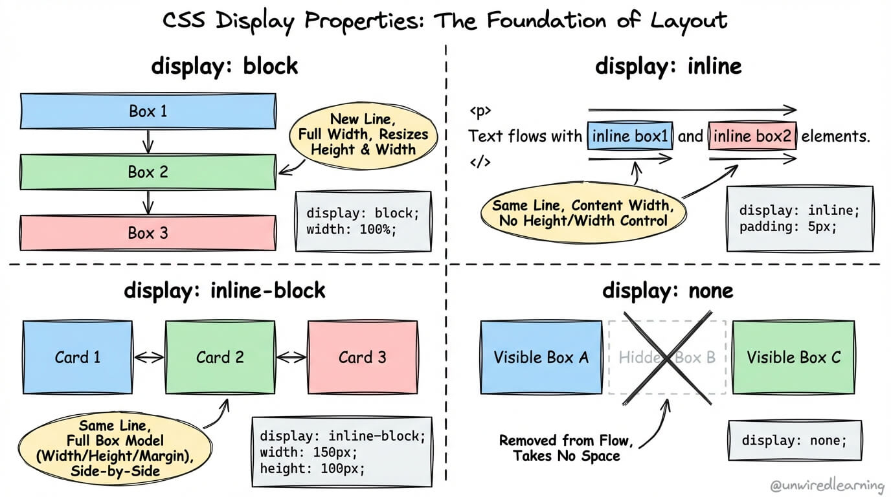
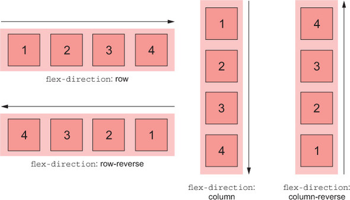
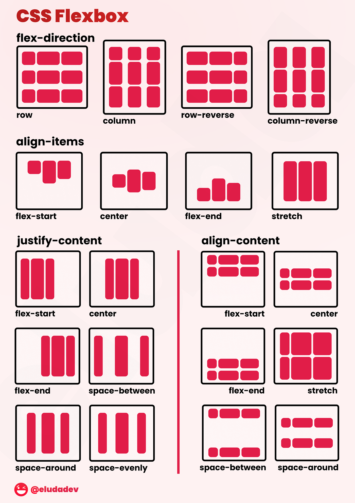
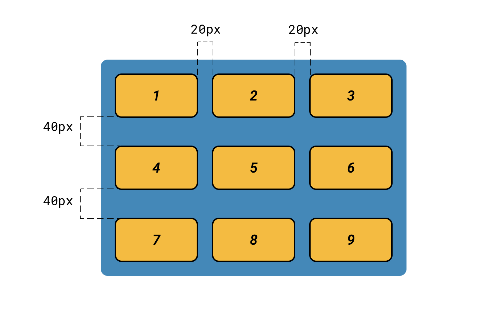
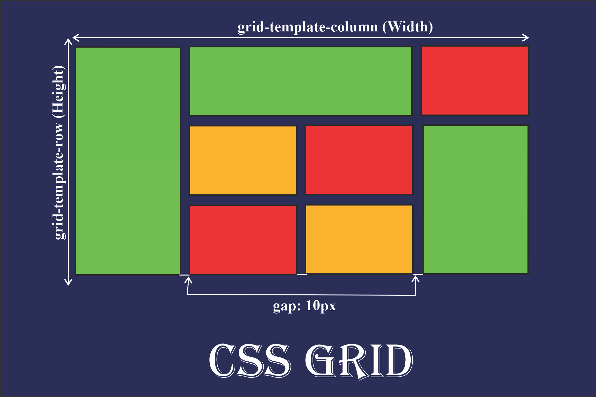
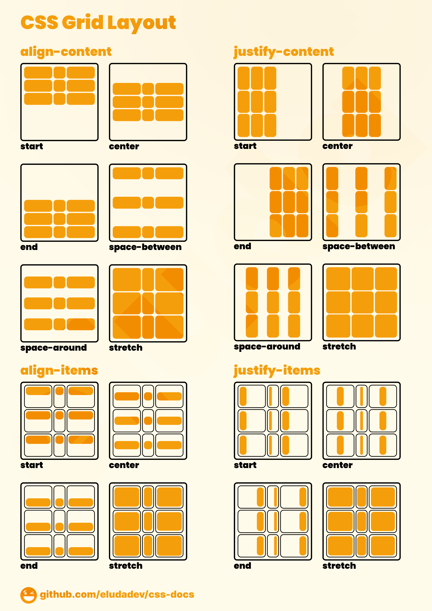

# Теория к третьему заданию

## Модель нормального потока и управление визуальным форматированием (Свойство display)

### Концепция нормального потока (Normal Flow)

Алгоритм рендеринга браузера по умолчанию располагает HTML-элементы последовательно, что в спецификации CSS определяется как нормальный поток документа.  В рамках данного потока узлы DOM-дерева классифицируются по двум базовым типам визуального поведения:

- **Блочные элементы (Block-level):** Данные элементы автоматически расширяются, занимая всю доступную ширину родительского контейнера, и инициируют перенос строки (к ним относятся семантические теги `<h1>`, `<p>`, `<div>`, `<section>`). Формирование блоков происходит строго по вертикальной оси.

- **Строчные элементы (Inline-level):** Габариты таких элементов строго детерминированы объемом их внутреннего контента, и они не создают разрывов строк (например, теги `<a>`, `<span>`, `<strong>`). Их распределение осуществляется по горизонтальной оси, аналогично текстовым символам в предложении.

Подробнее изучить тему можно [тут](https://developer.mozilla.org/ru/docs/Web/CSS/Guides/Display/Flow_layout) 

### Декларативное управление поведением: Свойство `display`

Базовым инструментом CSS для модификации стандартной модели рендеринга элемента в нормальном потоке выступает свойство `display`.
Ключевые директивы свойства:

- `display: block;` — принудительно наделяет элемент характеристиками блочного уровня.

- `display: inline;` — конвертирует элемент в строчный тип, что приводит к потере возможности декларативного управления его физическими размерами (свойства `width` и `height` игнорируются движком).

- `display: none;` — инициирует полное исключение узла из дерева рендеринга. Элементы с данным свойством отбрасываются парсером и не участвуют в процессе отрисовки на экране пользователя.

**Ограничения классической модели:**
Использование исключительно классических строчных и блочных моделей форматирования накладывает существенные ограничения на проектирование сложных современных интерфейсов (например, при необходимости распределить три карточки товара в один ряд с равными отступами). Для решения подобных инженерных задач W3C был внедрен модуль Flexbox, предоставляющий алгоритмы выравнивания элементов и построения сеток.



## Архитектура Flexbox (Flexible Box Layout)

Модуль гибкой блочной раскладки (Flexbox) представляет собой современный стандарт CSS, специально спроектированный для оптимизации распределения свободного пространства и динамического выравнивания элементов внутри контейнера.

Его фундаментальное отличие от других систем (например, модульной сетки CSS Grid) заключается в том, что он оперирует исключительно в одномерном пространстве: элементы могут распределяться только вдоль одного вектора — либо по горизонтали (в строку), либо по вертикали (в столбец). Эта спецификация позволяет контейнерам динамически изменять ширину, высоту и порядок своих элементов для наилучшего заполнения доступного пространства, предотвращая переполнение интерфейса.

### Структурная иерархия: Контейнер и элементы (Родительский и дочерние узлы)

Архитектура Flexbox базируется на строгом принципе DOM-иерархии. Механизм управления сеткой работает через установление специального контекста форматирования (flex formatting context) строго между двумя смежными уровнями элементов:

- **Flex-контейнер (Flex Container / Родительский узел):** Для инициализации алгоритма гибкой раскладки необходимо выбрать родительский HTML-элемент (элемент-обертку, например, `<header>`, `<ul>` или `<div>`) и декларативно присвоить ему свойство `display: flex;`. В этот момент стандартная блочная модель переопределяется, и данный узел становится гибким контейнером, который начинает диктовать физические правила поведения (оси и выравнивание) для своего содержимого.


- **Flex-элементы (Flex Items / Прямые потомки):** В момент активации flex-контейнера абсолютно все его прямые дочерние узлы автоматически конвертируются во flex-элементы, изменяя свое поведение в нормальном потоке.


*Критическое архитектурное ограничение:* Механизм Flexbox влияет исключительно на дочерние узлы первого уровня вложенности (прямых потомков). На элементы более глубокой вложенности (узлы-«внуки» и далее) эти правила не распространяются, и они продолжают вычисляться браузером согласно стандартному потоку, если только их прямым родителям также не будет задано свойство `display: flex;`.

## Геометрия осей (Основа пространственного мышления)

### Формирование двумерной системы координат

При инициализации контекста форматирования Flexbox (назначении родительскому элементу свойства `display: flex;`) движок рендеринга браузера разворачивает внутри этого узла независимую геометрическую систему координат. В отличие от стандартной блочной модели, где элементы следуют жесткой физике нормального потока (сверху вниз), Flexbox базируется на двух динамических, строго перпендикулярных осях.

Понимание архитектуры этих осей является критическим фактором, так как абсолютно все последующие алгоритмы выравнивания привязываются не к физическим краям экрана (верх/низ/право/лево), а именно к этим осям.

- **Главная ось (Main Axis):** Первичный вектор направления, вдоль которого осуществляется базовое распределение flex-элементов и вычисляются их пропорции. *Критическое замечание:* главная ось не является жестко зафиксированной горизонтальной линией. Ее физическая ориентация в пространстве полностью зависит от конфигурации контейнера.
- **Поперечная ось (Cross Axis):** Ортогональный (строго перпендикулярный) вектор по отношению к главной оси. Эта ось отвечает за распределение элементов в поперечном сечении, управление многострочностью и выравнивание элементов по их высоте или ширине (в зависимости от положения главной оси).

### Декларативное управление векторами: Свойство `flex-direction`

Свойство `flex-direction` выступает главным инструментом пространственного позиционирования. Оно применяется к родительскому flex-контейнеру и напрямую определяет геометрическую ориентацию Главной оси (Main Axis).

Данное свойство поддерживает четыре базовых директивы:

- `flex-direction: row;` (Состояние инициализации по умолчанию). Главная ось ориентируется горизонтально. Вектор направления совпадает с системным направлением письма (inline-вектором) — для русского языка элементы выстраиваются слева направо в единую строку.
- `flex-direction: row-reverse;` Сохраняет горизонтальную ориентацию главной оси, но математически инвертирует ее вектор. Элементы выстраиваются в строку, но их начальная точка (start) перемещается в правый край контейнера, из-за чего визуальный порядок элементов отображается задом наперед (справа налево).
- `flex-direction: column;` Осуществляет ротацию Главной оси на 90 градусов. Теперь первичный вектор выстраивается по вертикали (block-вектору), направляя элементы сверху вниз. Визуально элементы формируют классический столбец (колонку).
- `flex-direction: column-reverse;` Главная ось сохраняет вертикальную ориентацию, но вектор потока инвертируется. Элементы начинают выстраиваться снизу вверх, отталкиваясь от нижней границы родительского контейнера.



## Алгоритмы выравнивания (Alignment)

После инициализации системы координат (осей) движок рендеринга переходит к вычислению физических габаритов элементов. Если суммарный размер элементов меньше размеров контейнера, образуется **свободное пространство (free space)**.

Архитектура Flexbox предлагает строго детерминированные алгоритмы (свойства) для управления этим пространством. Важнейшее правило: свойства выравнивания `justify-content` и `align-items` декларируются **исключительно для родительского flex-контейнера**, так как именно он управляет своей внутренней геометрией.

### Распределение по Главной оси: Свойство `justify-content`

Данное свойство определяет алгоритм упаковки flex-элементов и распределения доступного свободного пространства строго вдоль текущей **Главной оси (Main Axis)**.

- `justify-content: flex-start;` *(Значение по умолчанию)*. Элементы упаковываются без зазоров и смещаются к стартовому краю (main-start edge) контейнера. Всё свободное пространство аккумулируется после последнего элемента.

- `justify-content: flex-end;` Элементы смещаются к конечному краю (main-end edge) контейнера. Пустое пространство остается перед первым элементом.

- `justify-content: center;` Элементы группируются по центру оси. Свободное пространство делится математически поровну на две части и размещается по краям группы.

- `justify-content: space-between;` Алгоритм распределения по крайним точкам. Первый элемент жестко фиксируется у стартового края, последний — у конечного. Всё оставшееся свободное пространство делится на равные доли и распределяется строго *между* элементами. (Классический паттерн для шапки сайта: логотип уходит влево, меню — вправо).

- `justify-content: space-around;` Элементы распределяются так, чтобы пустое пространство вокруг каждого элемента было одинаковым. При этом визуально отступы между элементами будут в два раза больше, чем отступы от крайних элементов до стенок контейнера.

### Выравнивание по Поперечной оси: Свойство `align-items`

Если `justify-content` оперирует распределением вдоль Главной оси, то `align-items` определяет, как элементы позиционируются вдоль **Поперечной оси (Cross Axis)** внутри текущей flex-линии.

- `align-items: stretch;` *(Значение по умолчанию)*. Если у flex-элементов не задан жесткий физический размер по поперечной оси (например, не указана высота `height` при `flex-direction: row`), движок принудительно растянет их так, чтобы они полностью заполнили пространство контейнера от края до края.

- `align-items: flex-start;` Элементы позиционируются относительно стартового края поперечной оси (cross-start). Их размер по этой оси определяется исключительно их внутренним контентом.

- `align-items: flex-end;` Элементы выравниваются по конечному краю (cross-end).

- `align-items: center;` Геометрическое центрирование узлов относительно середины поперечной оси. Это критически важный алгоритм для UI-разработки (например, для идеального выравнивания графической иконки и текстового узла разного размера на одной визуальной линии).

- `align-items: baseline;` Выравнивание элементов осуществляется не по физическим границам их прямоугольных контейнеров, а по базовой линии их текстового содержимого (шрифта). Полезно при выравнивании элементов с разным размером кегля.



## Управление пространством: Свойство gap

### Архитектурная проблема внешних отступов (Антипаттерн `margin`)

Исторически для создания дистанции между карточками или элементами меню разработчики применяли свойство `margin` (например, `margin-right: 20px;`). Однако в контексте гибких сеток этот подход порождает серьезную математическую коллизию: отступ применяется ко *всем* элементам, включая последний. В результате последний элемент отталкивается от правого края контейнера, разрушая идеальную симметрию сетки.

Для решения этой проблемы приходилось использовать сложные CSS-селекторы (например, псевдокласс `:last-child { margin-right: 0; }`), чтобы принудительно обнулять отступ у крайних узлов, либо применять хак с отрицательными маржинами (`negative margins`) на самом контейнере. Такой подход нарушает принцип инкапсуляции и усложняет поддержку кода.

### Инкапсуляция отступов: Свойство `gap`

Современный стандарт (спецификация *CSS Box Alignment Module*) предлагает концептуально иной, математически чистый подход — свойство `gap`.

Его главное архитектурное отличие заключается в **смещении зоны ответственности**. Мы больше не заставляем сами элементы (карточки) «расталкивать» соседей. Вместо этого мы делегируем задачу родительскому flex-контейнеру: мы приказываем ему создать фиксированные желоба (gutters) строго между своими потомками.

```css
.cards-container {
    display: flex;
    justify-content: space-between;
    gap: 20px;
}
```

### Математика вычисления зазоров (Gutters)

Алгоритм работы свойства `gap` обладает двумя критически важными характеристиками:

- **Строгая локализация (Inner Space Only):** Заданное пустое пространство генерируется **исключительно между** flex-элементами. Движок рендеринга гарантирует, что `gap` никогда не добавит лишних отступов между крайними элементами и внешними границами самого контейнера. Это делает расчет ширины сетки абсолютно предсказуемым.

- **Изоляция от нормального потока:** В отличие от `margin`, который является физической частью блочной модели самого элемента, `gap` является свойством контейнера. Если flex-элемент скрывается (например, через `display: none`), контейнер автоматически пересчитывает сетку, и лишний зазор (gap) просто исчезает.

### Многомерный синтаксис (Управление пересечениями)

Хотя Flexbox — это одномерная модель, при использовании свойства `flex-wrap: wrap;` (разрешение на перенос элементов на новую строку) у нас появляются ряды и колонки. Свойство `gap` позволяет управлять ими независимо с помощью двух значений — `gap: <row-gap> <column-gap>;`:

```css
.gallery-container {
    display: flex;
    flex-wrap: wrap;
    gap: 30px 15px;
}
```

*(Если указано только одно значение, например `gap: 20px;`, движок применит его симметрично к обеим осям).*



## Двумерная архитектура и макро-компоновка: Спецификация CSS Grid Layout

### Фундаментальное отличие от Flexbox (Переход к 2D топологии)

Модуль Flexbox, как было установлено ранее, ограничен одномерной (1D) топологией — он вычисляет распределение элементов исключительно вдоль одного активного вектора: либо по оси X (формируя строку), либо по оси Y (формируя колонку).

Спецификация **CSS Grid Layout**, утвержденная W3C, представляет собой фундаментальный сдвиг парадигмы в верстке. Grid — это полноценная **двумерная (2D) система позиционирования**. Она предоставляет браузерному движку рендеринга алгоритмы для одновременного вычисления пересечений по двум осям, формируя строгую координатную матрицу, состоящую из горизонтальных строк (rows) и вертикальных столбцов (columns).

### Архитектурный паттерн применения (Микро- и Макро-компоновка)

В современной инженерной практике существует строгое разделение зон ответственности между этими двумя спецификациями. Понимание этого паттерна убережет от создания избыточного и трудноподдерживаемого кода:

- **Flexbox (Микро-компоновка):** Оптимален для выравнивания узлов внутри изолированных UI-компонентов. Его задача — распределить контент там, где точные размеры заранее неизвестны (например, центрирование иконки и текстового лейбла внутри кнопки, или выстраивание адаптивного ряда ссылок в навигационной панели).

- **Grid (Макро-компоновка):** Спроектирован для формирования глобального структурного каркаса веб-страницы. Он позволяет жестко зафиксировать архитектурные зоны: шапку (header) сверху, боковую панель (sidebar) слева, блок основного контента (main) по центру и подвал (footer) снизу.

### Инициализация контекста форматирования сетки (Grid Formatting Context)

Аналогично архитектуре Flexbox, Grid опирается на строгую DOM-иерархию «Контейнер — Дочерние элементы». Чтобы развернуть координатную матрицу, мы должны инициировать контекст сетки, применив декларативное свойство к родительскому элементу:

```css
.layout-container {
    display: grid;
}
```

**Критический нюанс архитектуры Grid:**
Здесь кроется важнейшее отличие от гибкой раскладки. Применение свойства `display: flex;` немедленно изменяет визуальное отображение потомков, выстраивая их в плотную строку.

В случае же с `display: grid;`, первичная инициализация создает лишь базовый невидимый контекст. Визуально на странице ничего не изменится. Для того чтобы сетка начала физически управлять пространством, разработчик обязан **явно спроектировать ее топологию**. Без явной декларации шаблонов (указания количества колонок и строк) элементы будут располагаться в так называемой неявной сетке (implicit grid), визуально дублируя стандартное поведение блочных элементов в нормальном потоке.



## Формирование топологии сетки: Декларация треков и вычисление фракций

### Проектирование координатной матрицы (Явные Grid-шаблоны)

Основой двумерного позиционирования является явная декларация направляющих линий и пространств между ними, которые в спецификации называются **grid-треками (grid tracks)** — это пространство между двумя соседними линиями сетки (по сути, физические строки и столбцы).

Для строгого управления геометрией этой матрицы применяются свойства-шаблоны. Они инструктируют браузерный движок рендеринга, сколько треков необходимо сгенерировать и какими физическими или гибкими размерами они должны обладать.

* `grid-template-columns`: Декларирует количество и базовую ширину вертикальных треков (столбцов).
* `grid-template-rows`: Декларирует количество и базовую высоту горизонтальных треков (строк).

```css
.grid-container {
    display: grid;
    grid-template-columns: 200px 200px 200px;
    gap: 20px; 
}
```

### Динамическая математика сетки: Единица измерения `fr` (Fractional Unit)

Использование абсолютных единиц измерения (таких как `px`) накладывает жесткие архитектурные ограничения и противоречит парадигме адаптивного веб-дизайна (Responsive Web Design). Для решения проблемы гибкого масштабирования в спецификации Grid была введена принципиально новая единица измерения — **`fr` (от англ. *fraction* — доля, фракция)**.

Критически важно понимать математическую природу этой единицы: `fr` **не является физическим размером** (в отличие от процентов или пикселей). Это динамический коэффициент, который указывает браузеру, какую пропорциональную долю **доступного свободного пространства (available free space)** внутри контейнера должен занять конкретный трек.

Свободное пространство вычисляется браузером только *после* того, как из общей ширины контейнера вычтены все фиксированные элементы (например, отступы `gap` или колонки, заданные в `px`).

```css
.layout {
    display: grid;
    grid-template-columns: 250px 1fr; 
}

.gallery {
    display: grid;
    grid-template-columns: 1fr 2fr 1fr; 
}
```

**Механизм вычисления второго примера (`1fr 2fr 1fr`):**

1. Движок рендеринга суммирует все объявленные фракции для вычисления общего делителя: **1 + 2 + 1 = 4** (всего 4 доли).
2. Затем доступное пространство контейнера делится на эту сумму.
3. Крайние левая и правая колонки получают по 1/4 (25%) от доступного пространства. Центральная колонка получает коэффициент 2, то есть 2/4 (50%), становясь ровно в два раза шире соседних.
4. При любом изменении ширины окна браузера (viewport) этот математический алгоритм мгновенно пересчитывается, гарантируя безупречное сохранение пропорций интерфейса без написания дополнительных медиазапросов (Media Queries).

## Декларативное позиционирование: Координатная система Grid-линий

### Топология сетки: Индексация направляющих линий (Grid Lines)

Ключевая архитектурная особенность спецификации CSS Grid заключается в возможности полного отрыва визуального позиционирования элементов от их физического порядка в DOM-дереве (нормального потока). Для реализации этой механики браузерный движок генерирует скрытую систему координат, состоящую из пересекающихся направляющих — **линий сетки (Grid Lines)**.

Важнейший математический принцип спецификации: движок индексирует *не сами ячейки*, а именно границы (линии), которые формируют треки.

* *Правило вычисления:* Если матрица спроектирована из `N` колонок, она всегда будет обладать `N + 1` вертикальной направляющей линией. В сетке из 3 колонок линия `1` — это крайняя левая (стартовая) граница контейнера, а линия `4` — крайняя правая (конечная) граница.

*(Продвинутый инженерный нюанс: Спецификация также поддерживает алгоритм отрицательной (реверсивной) индексации. Линия `-1` всегда гарантированно указывает на абсолютно конечную границу явной сетки, независимо от количества спроектированных колонок. Это критически полезно для динамических макетов, когда точное количество колонок заранее неизвестно).*

### Алгоритмы явного позиционирования (Свойства управления диапазоном)

Разработчик обладает инструментарием для принудительного размещения дочернего узла (grid-item) в любой координатной зоне контейнера, а также для управления его диапазоном (spanning — поглощением соседних ячеек). Для этого применяются свойства-координаты: `grid-column` (позиционирование по оси X) и `grid-row` (позиционирование по оси Y).

Синтаксис этих свойств принимает значения в формате строгой декларации: `[стартовая-линия] / [конечная-линия]`.

```css
.header-item {
    grid-column: 1 / 4; 
}

.sidebar-item {
    grid-row: 1 / 3;
}
```

### Инженерные следствия (Разделение логики и представления)

Использование координатной системы Grid позволяет реализовывать сложные, многоуровневые асимметричные раскладки (так называемые «журнальные» верстки).

Главная архитектурная ценность этого метода заключается в **сохранении семантической чистоты HTML и улучшении Accessibility (a11y)**. Разработчик может расположить ключевой текстовый контент в самом начале HTML-документа (чтобы его мгновенно прочитали поисковые SEO-роботы и скринридеры для слабовидящих), но визуально, манипулируя координатами Grid-линий, отрисовать этот блок в самом низу или сбоку экрана. Визуальное представление больше не является заложником структуры исходного кода.

