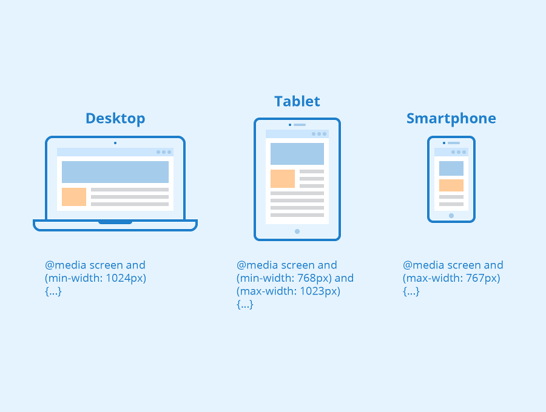

# Теория к четвертому занятию

## Адаптивный веб-дизайн и мобильная верстка

### Эволюция парадигм верстки и инициализация области просмотра (Viewport)

**1. Исторический контекст и проблема фиксированной компоновки (Fixed Layout)**

На ранних этапах развития веба доминировала десктопная парадигма: разработчики проектировали интерфейсы с жестко заданной шириной контейнеров (чаще всего 960px или 980px). С массовым распространением мобильных устройств браузерные движки столкнулись с архитектурной коллизией: физическая ширина экрана смартфона (например, 320px) была критически меньше ширины документа.

Для обхода этой проблемы мобильные браузеры (начиная с первого Safari для iOS) внедрили механизм **масштабирования (Overview Mode)**. Браузер искусственно отрисовывал страницу на виртуальном холсте шириной ~980px (Layout Viewport), а затем сжимал этот холст до физических размеров экрана (Visual Viewport). В результате пользователь видел сайт целиком, но контент становился нечитаемым, требуя постоянного применения жеста «pinch-to-zoom».

**2. Декларативное управление рендерингом: Мета-тег `viewport`**

Для перехода к парадигме адаптивного веб-дизайна (Responsive Web Design) потребовался механизм, позволяющий отключить принудительное масштабирование и передать контроль над шириной самому документу. Этим инструментом стал специальный мета-тег, который инструктирует браузерный движок о том, как именно следует проецировать CSS-пиксели на физический экран устройства.

Данная директива интегрируется исключительно в блок `<head>` HTML-документа:

```html
<meta name="viewport" content="width=device-width, initial-scale=1.0">
```

**3. Анатомия директивы и проекция пикселей**

Разберем параметры атрибута `content` с технической точки зрения:

* **`viewport` (Область просмотра):** Базовое понятие, описывающее видимую пользователю область веб-страницы.
* **`width=device-width` (Синхронизация ширины):** Ключевая команда, приказывающая браузеру приравнять ширину виртуального холста (Layout Viewport) к физической ширине экрана устройства (выраженной в аппаратно-независимых пикселях — DIPs). Именно это правило заставляет контент строиться в границах реального экрана (например, 390px для iPhone), а не растягиваться на 980px.
* **`initial-scale=1.0` (Базовый коэффициент масштабирования):** Устанавливает стартовое соотношение между CSS-пикселями и аппаратно-независимыми пикселями как 1:1. Это предотвращает автоматическое уменьшение или увеличение страницы браузером при первичной загрузке документа.

> **Инженерный постулат:** Отсутствие данного мета-тега в HTML-документе делает бессмысленным применение любых CSS-медиазапросов (`@media`) для мобильных устройств. Без директивы `viewport` мобильный браузер продолжит эмулировать десктопное разрешение, и медиазапросы для узких экранов (например, `max-width: 768px`) попросту не сработают.

### Концепция гибкой геометрии: Относительные единицы измерения (Fluid Layout)

**1. Архитектурные ограничения абсолютных величин**
В парадигме адаптивного веб-дизайна использование статических единиц измерения, таких как CSS-пиксели (`px`), накладывает критические ограничения на гибкость интерфейса. Пиксель является **абсолютной величиной**.

Декларирование жестких физических габаритов (например, `width: 500px`) создает недеформируемый контейнер. Если ширина области просмотра (viewport) мобильного устройства оказывается меньше заданного размера (например, 320px), элемент неизбежно выходит за пределы экрана. Движок рендеринга обрабатывает такое переполнение (overflow) путем генерации горизонтальной прокрутки, что считается грубым нарушением стандартов мобильного пользовательского опыта (UX).

Для создания масштабируемых интерфейсов применяются **относительные единицы**, которые вычисляются движком динамически в момент отрисовки страницы.

**2. Процентная модель вычисления (%)**
Базовым инструментом относительной геометрии являются проценты (`%`).
Фундаментальное правило спецификации: процентные значения всегда вычисляются строго относительно габаритов **прямого родительского контейнера** (в терминах W3C — *containing block*), а не самого окна браузера.

* **Динамическая ширина (`width: 100%`):** Элемент алгоритмически занимает всю доступную ширину контентной области своего родителя. При любом сужении или расширении родительского блока дочерний элемент мгновенно пересчитывает свои физические пиксели, сохраняя заданную пропорцию.
* *(Инженерный нюанс):* Использование процентов для высоты (`height: 100%`) сработает только в том случае, если у всей цепочки родительских элементов высота задана явно. Иначе браузер проигнорирует декларацию и схлопнет блок по объему его внутреннего контента (`height: auto`).

**3. Единицы области просмотра (Viewport-percentage lengths: `vw`, `vh`)**
Для решения проблемы зависимости элементов от DOM-иерархии (родительских контейнеров), в современный стандарт CSS были внедрены независимые единицы измерения. Они опираются исключительно на физические габариты окна браузера пользователя.

* **`vw` (Viewport Width):** Математическая доля, равная ровно 1% от текущей ширины области просмотра. (Например, `50vw` всегда будет равно ровно половине ширины экрана).
* **`vh` (Viewport Height):** Математическая доля, равная ровно 1% от текущей высоты области просмотра.

**Практическое применение (Паттерн Hero Section):**
Данные единицы незаменимы при проектировании полноэкранных интерфейсов. Если дизайн-система требует создания главного экрана (Hero Section), который должен идеально заполнять монитор пользователя без образования пустых зон снизу, узлу присваивается декларация `height: 100vh;`. Движок гарантированно растянет контейнер от верхней до нижней кромки браузера, независимо от того, открыт сайт на компактном смартфоне или ультрашироком мониторе.

Подробнее узнать [тут](https://learn.javascript.ru/css-units)

### Декларативное условное форматирование: Спецификация CSS Media Queries

**1. Парадигма условного ветвления в CSS**

По своей архитектурной природе CSS является линейным декларативным языком: парсер браузера считывает и применяет правила строго последовательно. Спецификация **CSS Media Queries (Медиа-запросы)** внедряет в этот процесс механизм логического ветвления.

Это фундаментальный инструментарий методологии адаптивного веб-дизайна (Responsive Web Design). Он позволяет движку рендеринга на этапе выполнения (runtime) запрашивать физические и системные характеристики пользовательского окружения (viewport) и применять инкапсулированные блоки стилей исключительно при истинности (значении `true`) заданного логического условия.

**2. Лексическая структура и медиа-функции (Media Features)**

Синтаксис спецификации базируется на директивах, называемых at-правилами (декларации, начинающиеся с символа `@`). Базовый медиа-запрос состоит из указания типа носителя (например, `screen` для цифровых экранов или `print` для печати на принтере) и одной или нескольких медиа-функций, заключенных в круглые скобки.

```css
.sidebar {
    width: 300px;
    display: block;
}

@media screen and (max-width: 768px) {
    .sidebar {
        width: 100%;
        display: none;
    }
}
```

**3. Архитектура контрольных точек (Breakpoints) и алгоритм пересчета**

Значения, передаваемые в качестве параметров в медиа-функции (в примере выше — `768px`), в инженерной терминологии классифицируются как **контрольные точки (breakpoints)**.

Это не просто визуальные границы, а строгие математические пороги. Когда пользователь физически изменяет размер окна браузера (или меняет ориентацию смартфона с портретной на альбомную), браузер постоянно отслеживает габариты области просмотра. При пересечении заданного порога срабатывает триггер: движок мгновенно пересчитывает объектную модель стилей (CSSOM), применяет новые правила каскадирования и инициирует процесс перерисовки интерфейса (Repaint и Reflow).



**4. Стратегии проектирования: Desktop-First vs Mobile-First**

При разработке архитектуры медиа-запросов применяются два противоположных концептуальных паттерна:

* **Desktop-First (Постепенная деградация):** Разработка начинается с написания базовых стилей для широкоформатных мониторов. Затем, с помощью медиа-функции `max-width`, интерфейс последовательно «упрощается» и адаптируется под узкие экраны. (Именно этот паттерн проиллюстрирован в коде выше).
* **Mobile-First (Прогрессивное улучшение):** Современный индустриальный стандарт. Базовый код вне медиа-запросов пишется строго для мобильных устройств, что минимизирует нагрузку на слабые процессоры смартфонов. Затем, с помощью функции `min-width`, интерфейс поэтапно «обрастает» сложными многоколоночными сетками и эффектами по мере расширения экрана.

### Практика: Топологическая трансформация сеток (Адаптация Flexbox и Grid)

В парадигме адаптивного дизайна переход от широкоформатных мониторов к мобильным устройствам требует фундаментального изменения геометрии интерфейса. Если десктопные решения тяготеют к распределению контента вдоль горизонтального вектора (inline-направление), то ограниченная физическая ширина мобильного *viewport* диктует необходимость строгого вертикального (block-ориентированного) потока.

Спецификации Flexbox и Grid Layout позволяют осуществлять эту трансформацию декларативно. Разработчику не требуется дублировать или переписывать HTML-разметку (DOM-дерево); адаптация происходит исключительно за счет мутации свойств контейнеров внутри медиа-запросов.

**1. Реориентация гибкого контекста форматирования (Flexbox)**

Главное архитектурное преимущество модуля Flexbox заключается в возможности мгновенной математической ротации системы координат. Для адаптации структурных элементов (например, шапки сайта) достаточно изменить вектор Главной оси.

В базовом контексте (desktop) элементы распределяются по горизонтали:

```css
.header-container {
    display: flex;
    flex-direction: row;
    justify-content: space-between;
}
```

При достижении мобильной контрольной точки (breakpoint) мы инициируем векторную трансформацию:

```css
@media (max-width: 768px) {
    .header-container {
        flex-direction: column;
        align-items: center;
        gap: 15px;
    }
}
```

*Механика процесса:* Свойство `flex-direction: column` отменяет горизонтальное распределение. Элементы выстраиваются в столбец, а свойство `align-items: center` гарантирует их точное позиционирование по центру экрана.

**2. Реструктуризация координатной матрицы (Grid Layout)**

В отличие от Flexbox, адаптация Grid-контейнеров базируется не на ротации осей, а на переопределении самих шаблонов направляющих треков (Track Sizing).

В базовом состоянии матрица проецируется на три равные колонки:

```css
.gallery {
    display: grid;
    grid-template-columns: 1fr 1fr 1fr;
}
```

При сужении области просмотра до 480px сохранение трех колонок приведет к критическому сжатию контента. Для решения этой инженерной задачи матрица упрощается до одномерного состояния:

```css
@media (max-width: 480px) {
    .gallery {
        grid-template-columns: 1fr; 
    }
}
```

*Механика процесса:* Передача единичного значения `1fr` алгоритмически уничтожает многоколоночную структуру. Все дочерние узлы (карточки) начинают выстраиваться в единый вертикальный столбец, который динамически поглощает 100% доступного свободного пространства контейнера.

**Фундаментальное резюме (Архитектурный принцип):**
Адаптивная верстка (Responsive Web Design) — это не создание обособленных версий сайта для каждого типа устройств. Это процесс грамотного проектирования каскада стилей, при котором алгоритмы рендеринга контейнеров точечно переопределяются в заданных контрольных точках. Данный подход гарантирует консистентное перераспределение контентных масс (reflow) и их органичное интегрирование в любые габариты физического экрана без возникновения ошибки горизонтального переполнения (overflow).